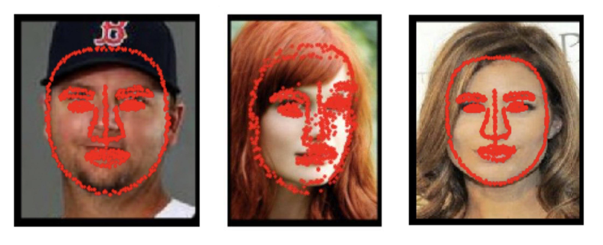
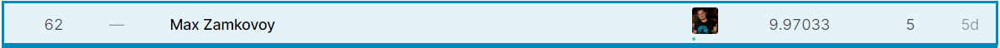
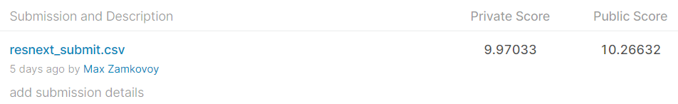

# MADE Thousand Facial Landmarks Competition

Модель состоит из resnext50_32x4d, предобученного на imagenet'е и линейного слоя на 1942 выхода.

При обучении не использовались аугментации (кроме ScaleMinSideToSize и CropCenter). Модель обучалась с помощью оптимизатора Adam (lr=0.001) в течение 20 эпох.

